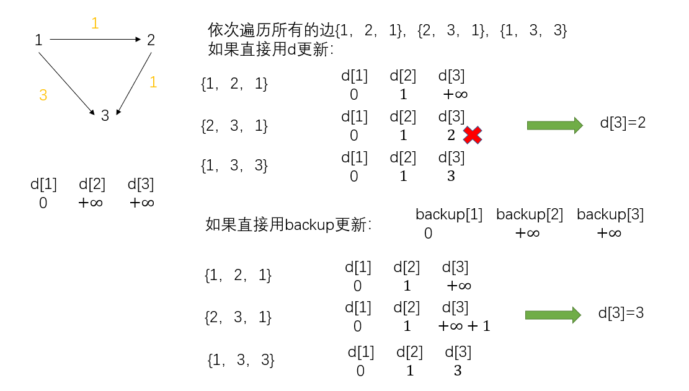

<font face="楷体" size = 3>

<center><font face="楷体" size=6, color='red'> 最短路 </font> </center>


---

### 朴素Dijkstra:
**（适用于点数少，边数多的稠密图，边权不能为负数）**

基本思路：**贪心**
（1）因为一般是稠密图，所以用邻接矩阵存储
（2）首先初始化邻接矩阵`g[a][b]`为正无穷，然后看是有向图还是无向图更新`g[a][b]=c`,或者`g[a][b]=g[b][a]=c`。
（3）`Dijkstra()`思路：首先更新`dist`为正无穷，令`dist[1]=0`[1表示起点];然后在所有未确定最短路的点中选择`dist`最小的那个，此时该点的最短路已经确定，标记为`1`；并用此结点更新其出边结点的最短路。
（4）`n`轮或者`n-1`轮后（每一轮会确定一个点的最短路，并更新出边结点的最短路，`n-1`轮后`n-1`个点确定，并更新了最后一个点的最短路，所以`n-1`轮即可确定所有点的最短路。）判断`d[n]`是否仍为无穷大（注意的是，`memset(d,0x3f,sizeof(d))`后`d[i]=0x3f3f3f3f`，这是因为`memset`是将每个字节赋值为`0x3f`,int占`4`个字节，所以是`0x3f3f3f3f`）。


```c++
int g[N][N]; // 存放邻接矩阵
int d[N], vis[N];
int dijkstra(){
    memset(d, 0x3f, sizeof d);
    d[1] = 0;
    
    for(int i = 0; i < n - 1; i++) { // 经过n - 1轮便可以确定所有点的最短路
        // 首先在未确定最短路的点中找到d最小的
        int j = - 1;
        for(int k = 1; k <= n; k++) {
            if (vis[k]) continue;
            if(j == - 1 || d[k] < d[j]) j = k;
        }
        vis[j] = 1;
        // 用当前节点k更新其出边节点的最短路
        for(int k = 1; k <= n; k++) {
            d[k] = min(d[k], d[j] + g[j][k]);
        }
    }
    if(d[n] == 0x3f3f3f3f) return -1;
    return d[n];
}
```
**时间复杂度：$O(n^2)$**

---

### 堆优化的Dijkstra:
**（适用于点数多的稀疏图，边权不能为负数）**

基本思路：[两处优化]
（1）首先是查找未确定的结点中的最小值这一步可以采用堆来优化
（2）另外在更新结点的时候，采用邻接表存储可以不必全部扫描所有的结点。
注意点：堆中存放的元素可能有冗余废弃的，需要做下判断：
		 
例如：当前的队列最小值为`{2，5}`，更新了结点`k`的距离`10`，并将其放入队列中`{10，k}`,然后，取出了队首元素`{3，6}`，更新了结点`k`的距离为`8`，并将其放入队列中`{8，k}`,后面，取出了`{8，k}`后仍会取出`{10，k}`，`{10，k}`就是冗余的，队列中的冗余元素很多，需要`continue`。

```c++
const int N=150010;
int e[N], h[N], w[N], ne[N], idx;
void add(int a, int b, int c) {
    e[idx] = b, w[idx] = c, ne[idx] = h[a], h[a] = idx++;
}
int d[N], vis[N];
int dijkstra() {
    memset(d, 0x3f, sizeof(d));
    priority_queue<pii, vector<pii>, greater<pii>>q;
    q.push({0, 1}); // ({d[i], i});
    
    while(q.size()) {
        auto [dist, u] = q.top();
        q.pop();
        
        if(vis[u]) continue; 
        vis[u] = 1; // 当前节点的最短路确定
        // 用当前节点更新其出边节点的最短路
        
        for(int i = h[u]; i != -1; i = ne[i]) {
            int j = e[i];
            if(dist + w[i] < d[j]) {
                d[j] = dist + w[i];
                q.push({d[j], j});
            }
        }
    }
    if(d[n] == 0x3f3f3f3f) return -1;
    return d[n];
}
```
**时间复杂度：$O(mlogn)$** 
分析：因为每次会访问一个节点，然后用当前节点更新其所有出边对应节点的最短路，总共有`m`条边, 因此总共会遍历`m`次，每次将一个元素插入队列的时间复杂度是`logn`,这里近似队列中包含所有的节点，但没有重复的。

---

#### 3341. 到达最后一个房间的最少时间 I
题意：一个二维矩阵，其中 `moveTime[i][j]` 表示在这个时刻以后你才可以开始往这个格子移动，每次往相邻格子移动的代价是1，问从左上角到右下角的最短时间。

```python
class Solution:
    def minTimeToReach(self, mt: List[List[int]]) -> int:
        n, m = len(mt), len(mt[0])
        dirs = [[-1, 0], [1, 0], [0, 1], [0, -1]] # 四个方向
        dis = [[inf] * m for _ in range(n)]
        vis = [[0] * m for _ in range(n)]
        dis[0][0] = 0
        h = [] # 优先队列，默认是小顶堆
        heappush(h, (0, 0, 0)) #(d, i, j)
        # 边界检查
        def check(i, j):
            if i < 0 or i >= n or j < 0 or j >= m: return 1
            else: return 0
        
        # dijkstra()
        while len(h):
            d, i, j = heappop(h)
            if vis[i][j]: continue
            vis[i][j] = 1
            
            # 更新出边
            for di, dj in dirs:
                x, y = i + di, j + dj
                if check(x, y): continue
                new_dis = max(d, mt[x][y]) + 1
                if new_dis < dis[x][y]:
                    dis[x][y] = new_dis
                    heappush(h, (dis[x][y], x, y))
        return dis[n - 1][m - 1]
```

### Bellman_ford:

适用场景：图中可能存在重边和自环，边权可能为负数。
找**最多经过k条边**的最短路,即有边数限制的最短路问题

基本思路：
（1）初始化`dist`

（2）一重循环：`for i=1->n`
**（`n==k`表示从起点最多经过`k`条边到所有点的最短路）**

（3）二重循环：遍历**所有的边**（边可以简单用结构体存储），进行松弛操作： 对于边`a -> b = c`
`d[b] = min(d[b], d[a] + c)`; 

 (4) 最后判断是否找到`1->n`的最短路[只走k条边]，只要看`d[n]`是否大于一个较大值就行，之所以不等于`0x3f3f3f3f`，是因为可能存在到`n`的负权边在不断降低`+∞`

注意点：
每次进入二重循环之前，即遍历所有的边之前，把`d`拷贝一份`backup`,用`backup`更新，避免发生串联更新。




```c++
int d[N], backup[N];
struct node {
    int a, b, w;
};
vector<node>v; // 存放所有的边
int bellman_ford() {
    memset(d, 0x3f, sizeof(d));
    d[1] = 0;
    
    for(int i = 0; i < k; i++) { // 最多走k条边
        memcpy(backup, d, sizeof(d));
        for(auto [a, b, w] : v) { // 遍历所有边
            d[b] = min(d[b], backup[a] + w);
        }
    }
    if(d[n] > 0x3f3f3f3f/2) cout<< "impossible" << endl;
    else cout << d[n] << endl;
}
```
**时间复杂度：$O(km)$** 

---


### SPFA 
(适用于存在负权边,判断负环，简单常用)

本质：队列优化的`bellman_ford`
因为：在`bellman_ford`算法的三角不等式，即：`d[b]=min(d[b],d[a]+w)`并非每次都更新。
只有`d[a]`发生变化时，`d[b]`才有可能更新。
所以将更新过的结点放入队列中，并用队列中的结点更新其他结点。

基本思路：
（1）初始化`d`数组，用`vis`数组表示每个点是否在队列中，在就不必重复插入
（2）将起点`1`放入队列中，`vis[1]=1`;
（3）依次取出队首元素`t`，将其`vis[t]=0`;并遍历其所有的出边，用三角不等式进行松弛操作，在松弛的过程中，将更新的结点且不在队列中的放入队列中。

当题目假设存在负权边，但是不存在负权回路的情况下，可以用下述代码：
```c++
void spfa() {
    memset(d, 0x3f, sizeof(d));
    d[1] = 0;
    
    queue<int>q;
    q.push(1);
    vis[1] = 1;
    
    while(q.size()) {
        auto u = q.front();
        q.pop();
        
        vis[u] = 0; // 当前节点u不在队列中了
        
        // 用当前节点更新其出边节点的最短路
        for(int i = h[u]; i != -1; i =ne[i]) {
            int j = e[i];
            if(d[u] + w[i] < d[j]) { 
                d[j] = d[u] + w[i]; // 节点j的最短路更新，将其放入队列中
                if(vis[j]) continue; // 如果j已经在队列中了，就不用重新加了
                q.push(j);
                vis[j] = 1;
            }
        }
    }
    if(d[n] == 0x3f3f3f3f) cout << "impossible" << endl;
    else cout << d[n] << endl;
}
```
**时间复杂度：$O(m)$, 最坏情况: $O(nm)$** 

#### spfa判负环

基本思路：
(1) 开辟一个新的数组`cnt`，`cnt[x]`记录`1`到`x`的最短路经过的点数(不包括自己)。
(2)	如果`cnt[x]>=n`，说明到`x`这一点加上自己一共经过了`n+1`个点，由抽屉原理可以得到，至少有一个点重复了，存在负环。
(3)	一开始要将所有的点放入队列中，而不是仅仅放入`1`，因为存在的负环不一定包括`1`这一点，可能在任何点之间构成。

```c++
bool spfa() {
    memset(d, 0x3f, sizeof(d));
    d[1] = 0;
    
    queue<int>q;
    for(int i = 1; i <= n; i++) q.push(i), vis[i] = 1; // 放入所有的点

    while(q.size()){
        auto u = q.front();
        q.pop();
        
        vis[u] = 0;
        
        for(int i = h[u]; i != -1; i = ne[i]) {
            int j = e[i];
            if(d[u] + w[i] < d[j]) {
                d[j] = d[u] + w[i];
                cnt[j] = cnt[u] + 1; // 核心
                if(cnt[j] >= n) return 1;
                if(vis[j]) continue;
                vis[j] = 1;
                q.push(j);
            }
        }
    }
    return 0;
}   
```
---

### Floyd
适用场景： 多源最短路径，可处理负权边，但不能处理负环

基本思路：**动态规划**
三重循环：  
```
for k in range(1, n):
    for i in range(1, n):
        for j in range(1, n):
            d[i][j] = min(d[i][j], d[i][k] + d[k][j]);
```

原理分析：[动态规划]
状态表示：令`d[k,i,j]` 表示只经过`1->k`之间的点,`i-j`的最短路径.
状态转移：`d[k, i, j] = d[k-1, i, k] + d[k-1, k, j]`。
所以当`d[k-1, i, j]`的所有状态更新好后，`d[k, i, j]`便可以在其基础上继续。

```c++
// Floyd算法运行后，g[i][j]表示i->j的最短路径
void floyd() {
    for(int k = 1; k <= n; k ++) 
        for(int i = 1; i <= n; i++) 
            for(int j = 1; j <= n; j++)
                g[i][j] = min(g[i][j], g[i][k] + g[k][j]);
}

// 初始化
for(int i = 0;i <= n; i++)
    for(int j = 0; j <= n; j++){
        if(i == j) g[i][j] = 0;
        else g[i][j] = inf;
    }
// 之后根据边的信息(a, b, c)更新g[a][b] = c
// 然后运用Floyd算法

```
**时间复杂度：$O(n^3)$** 
