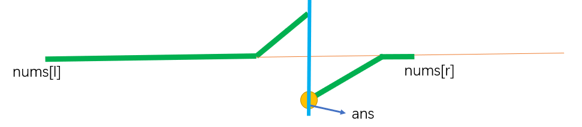

<font face="楷体" size = 3>

<center><font face="楷体" size=6, color='red'> 二分 </font> </center>

### 704.二分查找
题意：在升序数组中查找是否存在某个元素，返回下标；如果不存在，返回-1

#### 思路1: 右区间的左端点
**时间复杂度 $O(logn)$**
```c++
class Solution {
public:
    int search(vector<int>& nums, int x) {
        int l = 0, r = nums.size() - 1;
        while(l < r){
            int mid = (l + r) >> 1;
            if(nums[mid] >= x) r = mid;
            else l = mid + 1; 
        }
        if(nums[l] != x) return -1;
        else return l; 
    }
};
```
#### 思路2：左区间的右端点
**时间复杂度 $O(logn)$**
```c++
class Solution {
public:
    int search(vector<int>& nums, int x) {
        int l = 0, r = nums.size() - 1;
        while(l < r){
            int mid = (l + r + 1) >> 1;
            if(nums[mid] <= x) l = mid;
            else r = mid - 1;
        }
        if(nums[l] != x) return -1;
        else return l; 
    }
};
```
为什么模版一要用`mid=(l+r)≫1` 而模板二要用`mid=(l+r+1)≫1`？

因为可以发现：`mid=(l+r)≫1`不会取到`r`这个点，所以可以找到左端点，而`mid=(l+r+1)≫1`不会取到`l`这个点，所以可以找到右端点。

**注意点**：
* 二分终止条件是：`l==r`,所以`return a[l]`和`a[r]`都可以。
* 二分采用右移运算>>1，是向下取整。而采用除二运算/2，是向零取整。
* 有时候求`mid=(l+r)≫1`会溢出，所以可换为：`mid=l+(r-l)/2`。
同理`mid=(l+r+1)≫1`可换为`mid=l+(r-l+1)/2.`

**核心**：
如果求右区间的左端点，用模版一：
`mid=(l+r)≫1,r=mid`（满足右区间性质）,`l=mid+1`（不满足）

如果求左区间的右端点，用模板二：
`mid=(l+r+1)≫1,l=mid`（满足左区间性质）,`r=mid-1`（不满足）

---

**python**中的二分函数
```python
#第1个参数是列表，第2个参数是要查找的数，返回值为索引
bisect_left(ls, x) :  大于x的第一个元素下标 [等于lower_bound]
bisect_right(ls, x) : 大于等于x的第一个元素下标 [等于upper_bound]
```

### 34. 在排序数组中查找元素的第一个和最后一个位置
题意：给定一个升序数组，找到某个元素的起始和结束位置，不存在的话返回{-1,-1}

#### 思路1：两个两分模板
```c++
class Solution {
public:
    vector<int> searchRange(vector<int>& nums, int x) {
        int n = nums.size();
        if(n == 0) return {-1, -1};
        int l = 0, r = n - 1;
        while(l < r){  // 找右区间的左端点[左边界]
            int mid = (l + r) >> 1;
            if(nums[mid] >= x) r = mid;
            else l = mid + 1;
        }
        if(nums[l] != x) return {-1,-1};
        int res = l;
        l = 0, r = n - 1;
        while(l < r) {  //找左区间的右端点[右边界]
            int mid = (l + r + 1) >> 1;
            if(nums[mid] <= x) l = mid;
            else r = mid - 1;
        }
        return {res, l};
    }
};
```

#### 思路2：STL
```c++
class Solution {
public:
    vector<int> searchRange(vector<int>& nums, int x) {
        // lower_bound: 第一个大于等于x的迭代器
        // upper_bound: 第一个大于x的迭代器
        int left = lower_bound(nums.begin(), nums.end(), x) - nums.begin();
        if(left == nums.size() || nums[left] != x) return {-1, -1};
        int right = upper_bound(nums.begin(), nums.end(), x) - nums.begin();
        return {left, right - 1};
    }
};
```
---

### 367. 有效的完全平方数
题意：判断一个数是否是完全平方数(int范围内)

#### 思路1：二分
**时间复杂度$(log_2n)$**
```c++
class Solution {
public:
    bool isPerfectSquare(int num) {
        int l = 0, r = 1e6;
        while(l < r){
            int mid = (l + r) >> 1;
            if((long long) mid * mid >= num) r= mid;
            else l = mid + 1; 
        }
        if ((long long )l * l == num) return 1;
        else return 0;
    }
};
```

#### 思路2：牛顿法[用来求零点的]
关键在于推出迭代公式
本质就是求函数$f(x) = x^2 - num$的零点
1. 因为我们主要关注正数解，首先选取`x`大于$\sqrt{num}$的点，比如`num`开始迭代。
2. 过当前点$(x_i, x_i^2 - num)$作一条切线，切线与`x`轴的交点为下一个迭代的点$x_{i+1}$, 切片斜率为$f'(x_i) = 2x_i$.
3. 切片方程为[点斜式] $y - (x_i^2 - num) = 2x_i(x - x_i)$, 令`y`等于0找到与`x`轴的交点$x_{i+1}=x=\frac{(x_i^2 + num)} {2x_i} = \frac{1}{2}(x_i + num/ x_i)$
4. 直到$x_{i+1}$与$x_i$非常接近,说明当前已经基本收敛到零点。到此处，借助牛顿法求零点结束，接下来就是判断得到的零点是否是整数即可。
5. 然后向下取整，判断是否`x*x`等于num, 即可判断的得到的解`x`是否为正整数。
也就是题目要求的`num`是否是完全平方数。

可以证明每次迭代都可以将误差缩小到上一次的`1/4`
**时间复杂度$O(log_4n)$**
```c++
class Solution {
public:
    bool isPerfectSquare(int num) {
        double x = num;
        while(1){
            double y = 0.5 * (x + num / x);
            if(x - y < 1e-7) break;
            x = y;
        }
        x = int(x);
        return x * x == num;
    }
};
```
---


### 4. 寻找两个正序数组的中位数
```
nums1 = [1, 3, 5]
nusm2 = [2, 4, 6]
ans = (3 + 4) / 2 = 3.5
```
#### 划分数组法
将`nums1`分为2个部分，`left_1 = nums1[0: i - 1], right_1 = nums1[i: n]`
将`nums2`分为2个部分，`left_2 = nums2[0: j - 1], right_2 = nums2[j: m]` 

其中`left = left1 + left2; right = right1 + right2`
`len(left) - len(right) <= 1`[如果是奇数，左半部分多一个]

左半部分的最大值：`left_max = max(nums1[i - 1], nums2[j - 1])`
右半部分的最小值：`right_min = min(nums1[i], nums2[j])`

因此：
（1）如果总和为奇数: 中位数 `= left_max`
（2）如果总和为偶数：中位数 `= (left_max + right_min) / 2`

难点：如何找到合适的`i, j`
二分`i`, 通过数量确定`j`, 找到满足`nums1[i - 1] <= nums2[j]`的最大的`i`, 此时就是分好的`i, j`. 可以用样例理解。

```c++
class Solution {
public:
    double findMedianSortedArrays(vector<int>& nums1, vector<int>& nums2) { 
        int n = nums1.size(), m = nums2.size();
        // 避免在二分nums1时，nums2的j指针越界，所以要求nums1.size() < nums2.size();
        if(n > m) return findMedianSortedArrays(nums2, nums1);
        // 特判
        if(n == 0) return (nums2[m / 2] + nums2[(m - 1) / 2]) / 2.0;
        int nn = (n + m + 1) / 2; // len(left)
        int l = 0, r = n; // 此时的数字表示数量，而非索引。
        while(l < r){ // 左区间的右端点，左区间成立，右区间不成立
            int i = (l + r + 1) >> 1; // en(left_1) = i，对应于right_1的索引
            int j = nn - i; // len(right_1) = j, 对应于right_2的索引
    
            int l1 = (i == 0) ? INT_MIN : nums1[i - 1];
            int r2 = (j == m) ? INT_MAX : nums2[j];

            if(l1 <= r2) l = i;
            else r = i - 1;
        }

        int i = l, j = nn - l;
        int l1 = (i == 0) ? INT_MIN : nums1[i - 1];
        int r1 = (i == n) ? INT_MAX : nums1[i];
        int l2 = (j == 0) ? INT_MIN : nums2[j - 1];
        int r2 = (j == m) ? INT_MAX : nums2[j];
        int med1 =  max(l1, l2); // left_max
        int med2 =  min(r1, r2); // right_min
       
        return (n + m) % 2 ? med1 : (med1 + med2) / 2.0;

    } 
};
```
---


### 剑指 Offer 11. 旋转数组的最小数字
`numbers = [3,4,5,1,2], ans = 1`

**两种情况：有重复元素和无重复元素**

#### 通用方法：遍历
如果当前的数小于之前的，当前就是最小的。
```c++
int minArray(vector<int>& numbers) {
    for(int i = 1; i < numbers.size(); i++) 
        if(numbers[i] < numbers[i - 1]) return numbers[i];
    return numbers[0];
}
```
**时间复杂度$O(n)$**

<1> 当无重复元素时：

#### 普通二分
```c++
class Solution {
public:
    int minArray(vector<int>& nums) {
        int n = nums.size();
        int l = 0, r = n - 1;
        int x = nums[r];
        while(l < r) {
            int mid = l + r >> 1;
            if(nums[mid] <= x) r = mid; // 右区间都<=x
            else l = mid + 1;  // 做区间都>x
        }
        return nums[l];
    }
};
```
**时间复杂度$O(logn)$**

<2> 当有重复元素时

#### 双指针二分
因为有重复元素后，左右区间都可以等于`nums[r]`,所以无法普通二分。



定义两个指针`l，r`分别指向数组前后,`mid=l+r>>1`。
（1）	如果`nums[mid]>nums[r]`,说明`ans`在`mid`右边，所以：`l=mid+1`; ( `nums[mid]`因为不是最小所以不可能是答案)
（2）	如果`nums[mid]<nums[r]`,说明`ans`在`mid`左边，所以：`r=mid`;（`nums[mid]`可能是答案）
（3）	如果`nums[mid]==nums[r]`,无法判断在`ans`在`mid`左边还是右边，解决方法；`r--`。
因为此时`nums[r]`有替代品了，忽略后不影响答案的查找，(答案只要求数值，不求位置)

```c++
class Solution {
public:
    int minArray(vector<int>& nums) {
        int n = nums.size();
        int l = 0, r = n - 1;
        while(l < r) {
            int mid = l + r >> 1;
            if (nums[mid] > nums[r]) l = mid + 1;
            else if(nums[mid] < nums[r]) r = mid;
            else r--;
        }
        return nums[l];
    }
};
```
上述思路不宜想而且容易错

**替代方法：**
因为有重复元素后左右区间性质有重叠，不能普通二分，所以可以通过删除元素来使得条件满足。例如如果`nums[l]==nums[r]`,`l++`,做完后，左区间所有元素大于`nums[r]`,右区间所有元素小于等于`nums[r]`，找右区间的左端点。删左边和删右边重复元素均可。

```c++
class Solution {
public:
    int minArray(vector<int>& nums) {
        int n = nums.size();
        int l = 0, r = n - 1;
        while(l < r && nums[l] == nums[r]) l++;
        int x = nums[r];
        while(l < r) {
            int mid = l + r >> 1;
            if (nums[mid] <= x) r = mid;
            else l = mid + 1;
        }
        return nums[r]; // nums[l]也对
    }
};
```
---


### 540. 有序数组中的单一元素
一个有序数组，每个元素都出现了2次，有一个元素出现了一次，找出这个出现了一次的数。
特点：有序，有一个出现了一次。

核心：分类讨论, 找出左右区间的特点
在答案左边的区间，满足`nums[i] == nums[i + 1] i 是偶数`
在答案右边的区间，满足`nums[i] != nums[i + 1] i 是偶数`

即如果i是奇数，和比它小的偶数比`[i - 1]`
如果i是偶数，和比它大的奇数比`[i + 1]`

```c++
[1] mid 是偶数， mid ^ 1 = mid + 1;
[2] mid 是奇数， mid ^ 1 = mid - 1;

```

```c++
class Solution {
public:
    int singleNonDuplicate(vector<int>& nums) {
        int l = 0, r = nums.size() - 1;
        while(l < r) {
            int mid = (l + r) >> 1;
            if(nums[mid] == nums[mid ^ 1]) l = mid + 1;
            else r = mid;
        }
        return nums[l];
    }
};
```
---

