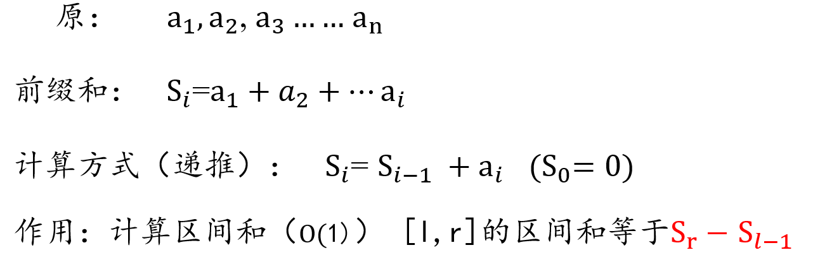
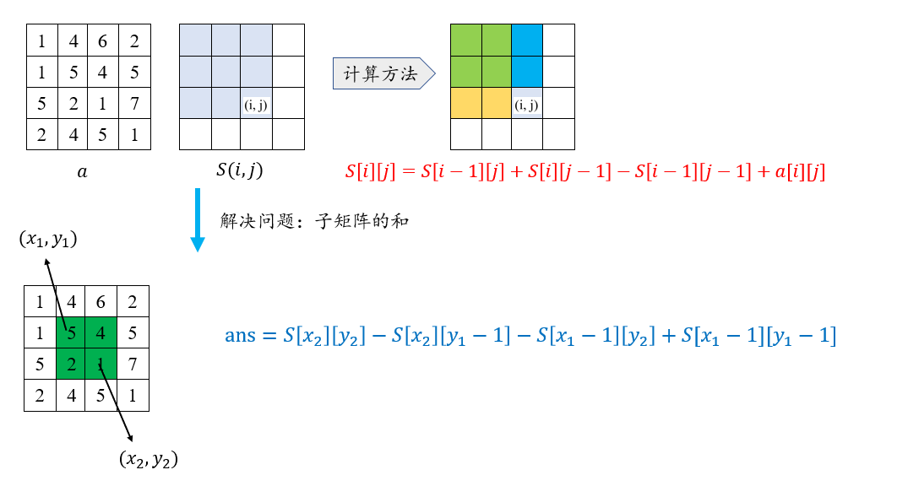
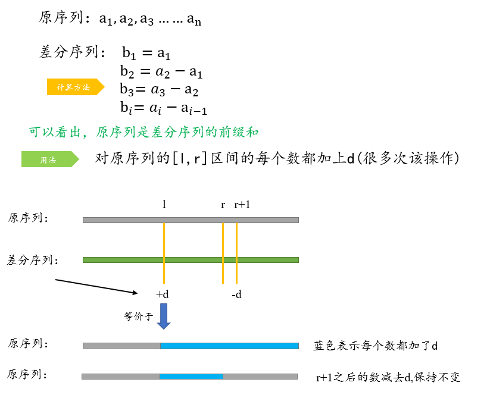
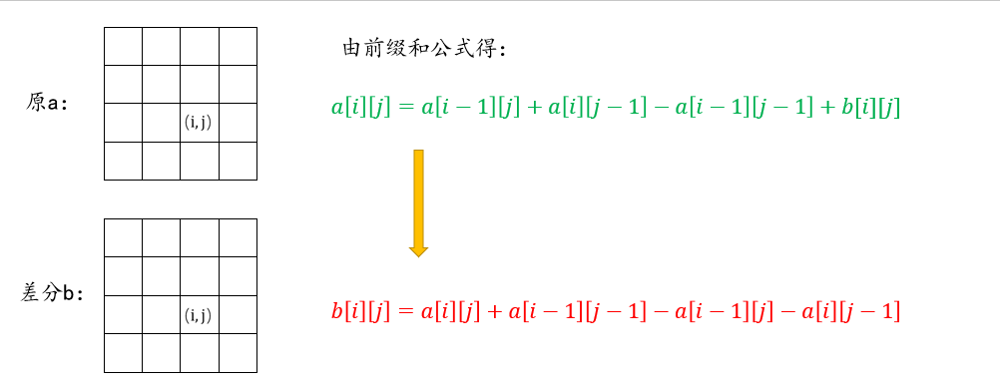
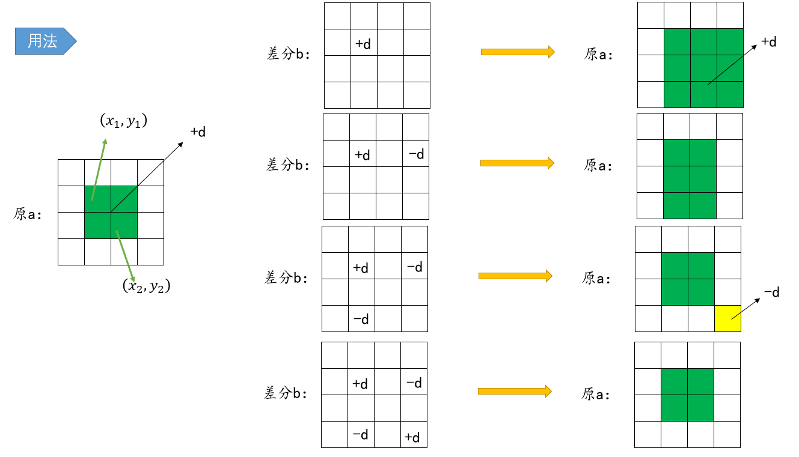

<font face="楷体" size = 3>

<center><font face="楷体" size=6, color='red'> 前缀和 </font> </center>

**适用问题：多次询问某段区间(1维或2维)的和**

### 一维前缀和：


### 二维前缀和：



### acwing 796. 子矩阵的和

```c++
input
3 4 3  //3*4的矩阵，3次询问
1 7 2 4
3 6 2 8
2 1 2 3
1 1 2 2  // 左上角和右下角的坐标
2 1 3 4
1 3 3 4
output
17
27
21

S[i, j] = 第i行j列格子左上部分所有元素的和
以(x1, y1)为左上角，(x2, y2)为右下角的子矩阵的和为：
S[x2, y2] - S[x1 - 1, y2] - S[x2, y1 - 1] + S[x1 - 1, y1 - 1]
``` 
```c++
#include<bits/stdc++.h>
using namespace std;
const int N=1010;
int a[N][N], b[N][N];
int main()
{
    int n, m, q;
    cin >> n >> m >> q;
    for (int i = 1; i <= n; i++) 
        for (int j = 1; j <= m; j++)
            cin >> a[i][j];
    for (int i = 1; i <=n; i++) 
        for (int j = 1; j <= m; j++)
            b[i][j] = b[i - 1][j] + b[i][j - 1] - b[i - 1][j - 1] + a[i][j];
    while (q--) {
        int l1, r1, l2, r2;
        cin >> l1 >> r1 >> l2 >> r2;
        cout << b[l2][r2] - b[l1 - 1][r2] - b[l2][r1 - 1] + b[l1 - 1][r1 - 1] << endl;
    }
    return 0; 
}
```
---

### 需要加离散化操作

### acwing 802. 区间和
假定有一个无限长的数轴，数轴上每个坐标上的数都是`0`。
进行 `n`次操作，每次操作将某一位置 `x` 上的数加 `c`。
之后进行 `m` 次询问，每个询问包含两个整数 `l` 和 `r`，求出在区间 `[l,r]` 之间的所有数的和。
$−10^9≤x≤10^9$
$1≤n,m≤10^5$

本题看上去就是用前缀和做，但问题在于`x`的范围太大，开不了这么大的数组，但是一共只有$n=10^5$个数，所以将原始序列离散化，只考虑他们的相对大小关系，而忽略它们之间的距离。

```c++
#include<bits/stdc++.h>
using namespace std;
const int N=300010;
typedef pair<int, int>PII;
vector<PII>insert, query;
vector<int>alls;
int main()
{
    int n, m;
    cin >> n >> m;
    for (int i = 0; i < n; i++) {
        int x, c;
        cin >> x >> c;
        alls.push_back(x);
        insert.push_back({x, c});
    }
    for (int i = 0; i < m; i++) {
        int l, r;
        cin >> l >> r;
        query.push_back({l, r});
        alls.push_back(l);
        alls.push_back(r);
    }
    sort(alls.begin(), alls.end());
    alls.erase(unique(alls.begin(), alls.end()), alls.end());
    vector<int>a(alls.size() + 1, 0);
    for (auto [x, d] : insert) {
        // +1 意味着从1开始存，为了之后求前缀和
        int pos = lower_bound(alls.begin(), alls.end(), x) - alls.begin() + 1; // 肯定存在
        a[pos] += d;
    }
    // 求前缀和
    vector<int>S(alls.size() + 1, 0);
    for (int i = 1; i < a.size(); i++)  S[i] = S[i - 1] + a[i];
    for (auto [l, r] : query) {
        int ll = lower_bound(alls.begin(), alls.end(), l) - alls.begin() + 1;
        int rr = lower_bound(alls.begin(), alls.end(), r) - alls.begin() + 1;
        cout << S[rr] - S[ll - 1] << endl;
    }
    return 0;
}
```
---

### 1365. 有多少小于当前数字的数字
对于数组中的每个数字，返回数组中比它小的元素的个数
`nums = [8,1,2,2,3]`
`ans = [4,0,1,1,3]`

#### 思路1：直接两重循环找，$O(n^2)$
#### 思路2：用pair保存每个数字的位置，然后排序 $O(nlogn)$
#### 思路3：计数排序（前缀和）$O(2n + k), k=100$
因为每个数字范围为`[0, 100]`
```c++
class Solution {
public:
    vector<int> smallerNumbersThanCurrent(vector<int>& nums) {
        vector<int>a(110, 0);
        for(auto x : nums) a[x]++;
        for (int i = 1; i <= 100; i++) a[i] += a[i - 1];
        vector<int>ans;
        for (auto x : nums) ans.push_back(x == 0 ? 0 : a[x - 1]);
        return ans;
    }
};
```
---


<center><font face="楷体" size=6, color='red'> 差分 </font> </center>

**适用问题：多次给某段区间同时加上某个数**

性质：差分求前缀和 = 原始序列
给区间`[l, r]`中的每个数加上`c`：`B[l] += c, B[r + 1] -= c`

### 一维差分：


### acwing 797. 差分
```c++
input
6 3 // 6个数，3次操作
1 2 2 1 2 1
1 3 1  // [1,3]的数加上1
3 5 1
1 6 1
output
3 4 5 3 4 2
```

```c++
#include<bits/stdc++.h>
using namespace std;
const int N=100010;
int a[N], b[N];
int main()
{
    int n, m;
    cin >> n >> m;
    for (int i = 1; i <= n; i++) cin >> a[i];
    // 求差分序列
    for (int i = 1; i <= n; i++) b[i] = a[i] - a[i - 1];
    while (m--) {
        int l, r, x;
        cin >> l >> r >> x;
        b[l] += x, b[r + 1] -= x; // 求差分序列操作
    }
    // 求前缀和还原
    for (int i = 1; i <= n; i++) a[i] = a[i - 1] + b[i];
    for (int i = 1; i <= n; i++) cout << a[i] << " ";
    cout << endl;
    return 0;
}
```
---

### 二维差分：




### acwing 798. 差分矩阵

```c++
input
3 4 3  // 3*4 的矩阵， 3次操作
1 2 2 1
3 2 2 1
1 1 1 1
1 1 2 2 1 // 对应子矩阵的所有元素加x
1 3 2 3 2
3 1 3 4 1
output  // 返回修改后的矩阵
2 3 4 1
4 3 4 1
2 2 2 2

**构造差分矩阵**
原序列：                    
a[i - 1][j - 1], a[i - 1][j]
a[i][j - 1],     a[i][j]

差分序列：                    
b[i - 1][j - 1], b[i - 1][j]
b[i][j - 1],     b[i][j]

因为差分序列的前缀和是原序列，即
S[i][j] = a[i][j] = a[i - 1][j] + a[i][j - 1] - a[i - 1][j - 1] + b[i][j] 
所以：
b[i][j] = a[i][j] + a[i - 1][j - 1] - a[i - 1][j] - a[i][j - 1]

给以(x1, y1)为左上角，(x2, y2)为右下角的子矩阵中的所有元素加上c：
S[x1, y1] += c, S[x2 + 1, y1] -= c, S[x1, y2 + 1] -= c, S[x2 + 1, y2 + 1] += c
```

```c++
#include<bits/stdc++.h>
using namespace std;
const int N=1010;
int a[N][N], b[N][N];
int main()
{
    int n, m, q;
    cin >> n >> m >> q;
    for (int i = 1; i <= n; i++) 
        for (int j = 1; j <= m; j++)
            cin >> a[i][j];
    // 构造差分矩阵
    for (int i = 1; i <= n; i++) 
        for (int j = 1; j <= m; j++)
            b[i][j] = a[i][j] + a[i - 1][j - 1] - a[i][j - 1] - a[i - 1][j];
    while (q--) {
        int l1, r1, l2, r2, x;
        cin >> l1 >> r1 >> l2 >> r2 >> x;
        b[l1][r1] += x, b[l1][r2 + 1] -= x, b[l2 + 1][r1] -= x, b[l2 + 1][r2 + 1] += x;
    }
    // 求前缀和得到原矩阵
    for (int i = 1; i <= n; i++) 
        for (int j = 1; j <= m; j++)
            a[i][j] = a[i - 1][j] + a[i][j - 1] - a[i - 1][j - 1] + b[i][j];
    
    for (int i = 1; i <= n; i++) {
        for (int j = 1; j <= m; j++)
            cout << a[i][j] << " ";
        cout << endl;
    }
    return 0;
}
```
---