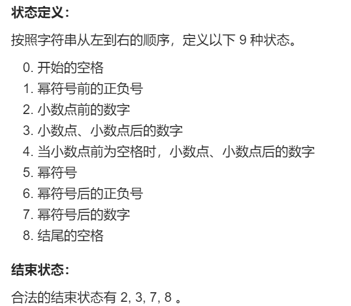
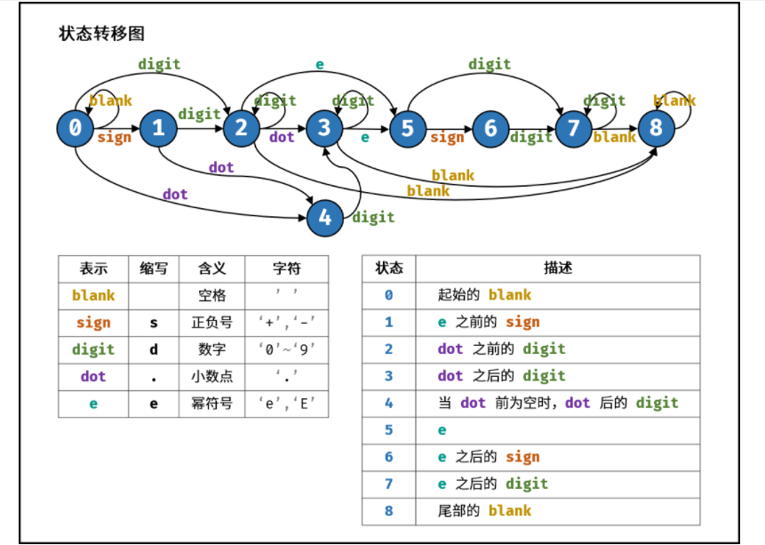

<font face="楷体" size = 3>

<center><font face="楷体" size=6, color='red'> 有限状态自动机 </font> </center>

### 剑指 Offer 20. 表示数值的字符串

判断给定的字符串是否是合法的数值表示
`" +5.2e-3 ", ans = 1`




```c++
class Solution {
public:
    bool isNumber(string s) {
        typedef unordered_map<char, int>uci;
        vector<uci>states = {
            {{' ', 0}, {'s', 1}, {'d', 2}, {'.', 4}}, // 每一行是一个uci(哈希表)
            {{'d', 2}, {'.', 4}},
            {{'d', 2}, {'.', 3}, {'e', 5}, {' ', 8}},
            {{'d', 3}, {'e', 5}, {' ', 8}},
            {{'d', 3}},
            {{'d', 7}, {'s', 6}},
            {{'d', 7}},
            {{'d', 7}, {' ', 8}},
            {{' ', 8}},
        };
        int p = 0; // 初始在状态0
        for(auto c : s) {
            char t;
            if(isdigit(c))  t = 'd';
            else if(c == '+' || c== '-') t = 's';
            else if(c == 'e' || c == 'E') t = 'e';
            else if(c == '.' || c == ' ') t = c;
            else t = '?'; // 非法字符
            if(states[p].count(t))  // 可以通过t转移
                p = states[p][t];
            else return 0;
        }   
        return p == 2 || p == 3 || p == 7 || p == 8 ;

    }
};
```