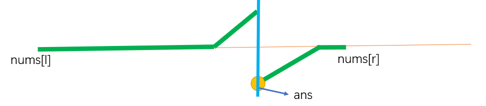

<font face="楷体" size = 3>

<center><font face="楷体" size=6, color='red'> 额外有价值的题目 </font> </center>

### 189. 轮转数组
将数组中的元素向右轮转 `k` 个位置
`nums = [1,2,3,4,5,6,7], k = 3`
`ans =  [5,6,7,1,2,3,4] `

空间复杂度为$O(1)$的做法：
数组元素向右循环移动`k`位,等价于：
先将数组翻转，然后再翻转前k个元素，再翻转后面的元素

```c++
class Solution {
public:
    // stl中的reverse涉及复制操作，因此自己写一个revserse
    void rev(vector<int>& a, int l, int r) {
        while(l < r) {
            swap(a[l], a[r]);
            l++;
            r--;
        }
    }
    void rotate(vector<int>& nums, int k) {
        k = k % nums.size();
        rev(nums, 0, nums.size() - 1);
        rev(nums, 0, k - 1);
        rev(nums, k, nums.size() - 1);
    }
};
```
---

### 剑指 Offer 03. 数组中重复的数字
在一个长度为 `n` 的数组 `nums` 里的**所有数字都在 `0～n-1` 的范围内**。数组中某些数字是重复的，但不知道有几个数字重复了，也不知道每个数字重复了几次。请找出数组中任意一个重复的数字。

#### 哈希表：
时间复杂度$O(n)$, 空间复杂度$O(n)$

#### 原位置换
找到每个数对应的坑位，如果出现多个数抢同一个坑位，则找到重复的数。
即：如果当前数字是2，就将其与nums[2]位置的数交换，那么当前的数字就找到了正确的位置，如果交换的位置已经被2占了，说明是重复的。

时间复杂度$O(n)$, 空间复杂度$O(1)$

```c++
class Solution {
public:
    int findRepeatNumber(vector<int>& nums) {
        for(int i = 0; i < nums.size(); i++) { // 依次考虑nums[i]的正确位置
            while(nums[i] != i) { // 当前nums[i]的位置不对
                // 当前nums[i] = 2, 应该与nums[nums[i]] = nums[2]的元素交换
                if(nums[i] == nums[nums[i]]) return nums[i];
                else swap(nums[i], nums[nums[i]]);
            }
        }
        return -1;
    }   
};
```

### 剑指 Offer 04. 二维数组中的查找
每一行都按照从左到右 **非递减** 的顺序排序，每一列都按照从上到下 **非递减** 的顺序排序。判断某个数是否存在

#### 思路：
从矩阵的右上角开始查找，如果等于，说明找到；如果小于目标值，则这一行之前的元素均小于目标值，直接行++；如果大于目标值，则这一列之后的元素均大于目标值，直接列--。
同理，也可以从左下角开始查找。

```c++
class Solution {
public:
    bool findNumberIn2DArray(vector<vector<int>>& matrix, int target) {
        int n = matrix.size();
        if(n == 0) return 0;
        int m = matrix[0].size();
        int i = 0, j = m - 1;
        while(i < n && j >= 0) {
            if(matrix[i][j] < target) i++;
            else if(matrix[i][j] > target) j--;
            else return 1;
        }
        return 0;
    }
};
```

### 剑指 Offer 11. 旋转数组的最小数字
`numbers = [3,4,5,1,2], ans = 1`

**两种情况：有重复元素和无重复元素**

#### 通用方法：遍历
如果当前的数小于之前的，当前就是最小的。
```c++
int minArray(vector<int>& numbers) {
    for(int i = 1; i < numbers.size(); i++) 
        if(numbers[i] < numbers[i - 1]) return numbers[i];
    return numbers[0];
}
```
**时间复杂度$O(n)$**

<1> 当无重复元素时：

#### 普通二分
```c++
class Solution {
public:
    int minArray(vector<int>& nums) {
        int n = nums.size();
        int l = 0, r = n - 1;
        int x = nums[r];
        while(l < r) {
            int mid = l + r >> 1;
            if(nums[mid] <= x) r = mid; // 右区间都<=x
            else l = mid + 1;  // 做区间都>x
        }
        return nums[l];
    }
};
```
**时间复杂度$O(logn)$**

<2> 当有重复元素时

#### 双指针二分
因为有重复元素后，左右区间都可以等于`nums[r]`,所以无法普通二分。



定义两个指针`l，r`分别指向数组前后,`mid=l+r>>1`。
（1）	如果`nums[mid]>nums[r]`,说明`ans`在`mid`右边，所以：`l=mid+1`; ( `nums[mid]`因为不是最小所以不可能是答案)
（2）	如果`nums[mid]<nums[r]`,说明`ans`在`mid`左边，所以：`r=mid`;（`nums[mid]`可能是答案）
（3）	如果`nums[mid]==nums[r]`,无法判断在`ans`在`mid`左边还是右边，解决方法；`r--`。
因为此时`nums[r]`有替代品了，忽略后不影响答案的查找，(答案只要求数值，不求位置)

```c++
class Solution {
public:
    int minArray(vector<int>& nums) {
        int n = nums.size();
        int l = 0, r = n - 1;
        while(l < r) {
            int mid = l + r >> 1;
            if (nums[mid] > nums[r]) l = mid + 1;
            else if(nums[mid] < nums[r]) r = mid;
            else r--;
        }
        return nums[l];
    }
};
```
上述思路不宜想而且容易错

**替代方法：**
因为有重复元素后左右区间性质有重叠，不能普通二分，所以可以通过删除元素来使得条件满足。例如如果`nums[l]==nums[r]`,`l++`,做完后，左区间所有元素大于`nums[r]`,右区间所有元素小于等于`nums[r]`，找右区间的左端点。删左边和删右边重复元素均可。

```c++
class Solution {
public:
    int minArray(vector<int>& nums) {
        int n = nums.size();
        int l = 0, r = n - 1;
        while(l < r && nums[l] == nums[r]) l++;
        int x = nums[r];
        while(l < r) {
            int mid = l + r >> 1;
            if (nums[mid] <= x) r = mid;
            else l = mid + 1;
        }
        return nums[r];
    }
};
```
---

### 剑指 Offer 39. 数组中出现次数超过一半的数字

#### 哈希表：
**时间复杂度$O(n)$, 空间复杂度$O(n)$**

#### 摩尔投票法：（正负相抵法）
投票法简单来说就是不同则抵消，占半数以上的数字必然留到最后。
基本思路：
每次假定当前考虑区间第一个数是“众数”，`+1`, 如果之后有与之不同的数`-1`，当正好为`0`时，说明“众数”肯定也存在与后面的区间，在后面的区间重新考虑

```c++
class Solution {
public:
    int majorityElement(vector<int>& nums) {
        int x, votes; //当前假定的众数，以及当前区间的票数
        for(auto e : nums) {
            if(votes == 0) x = e;
            if(e == x) votes ++;
            else votes--;
        }
        return x;
    }
};
```
**时间复杂度$O(n)$, 空间复杂度$O(1)$**

---

### 剑指 Offer 56 - I. 数组中数字出现的次数
一个整型数组 `nums` 里除**两个**数字之外，其他数字都出现了两次。
`nums = [4,1,4,6], ans = [1, 6]`

假设只有一个数字出现了一次，剩余都出现了两次，因此可以直接异或得到答案。
难点在于现在有两个数字，异或完后为`x ^ y`

解决办法为： 找到`x ^ y`的二进制表示中任意一位为`1`的位置，是`1`说明`x`与`y`在本位上不同，然后将所有数字按这位为`0`或者为`1`分成两个子数组，每个子数组的异或值就是答案.

```c++
class Solution {
public:
    vector<int> singleNumbers(vector<int>& nums) {
        int res = 0;
        for(auto x : nums) res ^= x;
        res = res & (-res); // 得到最低位的1对应的数 lowbit
        vector<int>ans = {0, 0};
        for(auto x : nums) {
            if(x & res) ans[0] ^= x; // 数字x该位为1
            else  ans[1] ^= x;
        }
        return ans;
    }
};
```
---

### 剑指 Offer 56 - II. 数组中数字出现的次数 II
在一个数组 `nums` 中除一个数字只出现一次之外，其他数字都出现了三次。

思路：二进制记录每一位出现的次数，如果出现的次数`%3 == 0`,说明目标数字的这一位为`0`, 否则为`1`

```c++
class Solution {
public:
    int vis[33];
    int singleNumber(vector<int>& nums) {
        memset(vis, 0, sizeof(vis));
        for(auto x : nums) {
            for(int i = 0; i <= 30; i++) {
                if(x & 1) vis[i] ++;
                x >>= 1;
            }
        }
        int res = 0, p = 1;
        for(int i = 0; i <= 30; i++) {
            if(vis[i] % 3) res += p;
            p <<= 1;
        }
        return res;
    }
};
```
---

### 剑指 Offer 60. n个骰子的点数
n个骰子，其向上的所有数字和`sum`的概率`p`

`2， ans = [0.02778,0.05556,0.08333,0.11111,0.13889,0.16667,0.13889,0.11111,0.08333,0.05556,0.02778]`

问题分析：
(1) 每个骰子向上6种情况，概率均为$\frac16$
(2) `n`个骰子可组成的数的范围在`[n, 6n]`, 因此总共`5n + 1`种不同的数
(3) 核心求解思路：

 

思路理解：假设之前的`n-1`个骰子的和为`x`，当前骰子分别取`1~6`,在原概率基础上乘以 $\frac16$ 得到数字和`x + 1 ~ x + 6`概率.

```c++
class Solution {
public:
    vector<double> dicesProbability(int n) {
        vector<double>dp(6, 1.0 / 6.0);
        for(int i = 2; i <= n; i++) {
            vector<double>cur(5 * i + 1, 0);
            for(int j = 0; j < dp.size(); j++) {
                for(int k = 0; k < 6; k++) {
                    cur[j + k] += dp[j] * (1.0 / 6.0);  // 核心
                }
            }
            dp = cur; // 给下一次转移用
        }
        return dp;
    }
};
```
---

### 剑指 Offer 64. 求1+2+…+n
求`1+2+...+n` ，要求不能使用乘除法、`for、while、if、else、switch、case`等关键字及条件判断语句`（A?B:C）`。

#### 利用 && 短路原则
如果采用递归，终止条件处通常会涉及`if`判断，或者`？: `语句 
```c++
class Solution {
public:
    int sumNums(int n) {
        n > 1 && (n += sumNums(n - 1)) > 0;
        return n;
    }
};
```

#### sizeof
```c++
class Solution {
public:
    int sumNums(int n) {
        bool a[n][n + 1];
        return sizeof(a) >> 1;
    }
};
```
---

### 剑指 Offer 65. 不用加减乘除做加法
`a = 1, b = 2,  ans = 3`

####  位运算模拟
```c++
class Solution {
public:
    int add(int a, int b) {
        int t = 0;
        int ans = 0;
        for(int i = 0; i <32; i++) {
            int pa = (a >> i) & 1;
            int pb = (b >> i) & 1;
            if(pa && pb) {
                if(t) ans |= (1 << i);
                t = 1;
            }
            else if(pa || pb) {
                if(!t) ans |= (1 << i); 
            }
            else {
                if(t) ans |= (1 << i);
                t = 0;
            }
        }
        return ans;
    }
};
```

#### 简化版
```c++
class Solution {
public:
    using ui = unsigned int;
    int add(int a, int b) {
        if(!b) return a;
        return add(a^b, (ui)(a&b) << 1);
    }
};
```
`a^b模拟的是加法的过程， a&b 模拟的是进位的过程`

---

### 89. 格雷编码
构造出长度为`n`的格雷码[从0开始]

#### 公式法：
第`i`个格雷码为$g_i = i \oplus  \frac{i}{2} = i \oplus (i >> 1)$

```c++
class Solution {
public:
    vector<int> grayCode(int n) {
        vector<int>res;
        for(int i = 0; i < pow(2, n); i++) {
            res.push_back(i ^ (i >> 1));
        }
        return res;
    }
};
```

### 构造法
```
n = 0  [0]
n = 1  [0, 1]
n = 2  [00，01，11，10]
n = 3  [000, 001, 011, 010, 110, 111, 101, 100]
```
通过观察可以发现：
假设现在考虑`n = i` , `n = i - 1`的格雷码为$G_{i - 1}$
那$G_i$的前半部分为$G_{i - 1}$前面补`0`[意味着前半部分结果不变]
那$G_i$的后半部分为$G_{i - 1}$前面补`1`

```c++
class Solution {
public:
    vector<int> grayCode(int n) {
        vector<int>g = {0};
        for(int i = 1; i <= n; i++) {
            int m = g.size();
            // 后半部分翻转并加1
            for(int j = m - 1; j >= 0; j--) g.push_back(g[j] | (1 << (i - 1)));
        }
        return g;
    }
};
```
---

### 1238. 循环码排列
相比于`89.` 格雷编码, 本题要求以`start`开始
一种思路是先找到从`0`开始的格雷码，然后向右找到`start`，然后进行循环左移
另一种更妙的思路是先找到从`0`开始的格雷码，然后所有元素与`start`异或即可：
简单证明：
(1) 因为`g[0] = 0`,`g[0] ^ start = start`,满足了`start`开头的要求
(2) `(g[i] ^ start) ^ (g[i + 1] ^ start) = g[i] ^ g[i + 1]`
因此不会改变相邻位相差为`1`的特性 

```c++
class Solution {
public:
    vector<int> circularPermutation(int n, int start) {
        vector<int>g;
        for(int i = 0; i < pow(2, n); i++) {
            g.push_back(i ^ (i >> 1) ^ start);
        }
        return g;
    }
};
```
---


### 887. 鸡蛋掉落
有`N`层楼，`K`个鸡蛋. 存在某一楼层`f`, `<=f`层鸡蛋不碎，`>f`层鸡蛋碎。
问最少需要多少次才能确定楼层`f`。（f未知，所以要考虑最坏的情况下）


状态表示：`f[n][k]`: `n`层楼， `k`个鸡蛋时的最少次数
状态转移：
<font face="楷体" size = 2> 
$f[n][k] = \mathop{min} \limits_{1<=x<=n} \{1 + max(f[n - x][k], f[x - 1][k - 1]) \}$ 
<font face="楷体" size = 3> 
假设从`x`层扔下
(1) 鸡蛋不碎：就用`k`个鸡蛋在上面的`n - x`层中找: `f[n - x][k]`
(2) 鸡蛋碎：就用`k - 1`个鸡蛋在下面的`x - 1`层找: `f[x - 1][k - 1]`
(3) 1表示当前仍的这一次

答案：`f[n][k]`
初始话：
`f[1][k] = 1 for k in range(1, ..)`
`f[n][1] = n for n in range(0, ..)`

**时间复杂度$O(kn^2)$** 时间复杂度较高，过不了

优化思路：因为公式优化是最小化最大值，因为可以考虑用二分：
`f[n - x][k]` 随着`x`增大，单调下降。[鸡蛋数不变，楼层变低了，因为需要的次数会变小]
`f[x - 1][k - 1]` 随着`x`增大，单调增加。

因此`max(f[n - x][k], f[x - 1][k - 1])`就是找两条直线的交叉点，形如`^`, 记`v1(下降) = f[n - x][k]; v2(上升) = f[x - 1][k - 1]`
因为可能不一定正好找到等于，就需要先找到右区间`v2 > v1`的左端点p, 然后比较v2[p]和v1[p-1]的大小，然后选一个最小的值。

**时间复杂度$O(knlogn)$**

```c++
class Solution {
public:
    int superEggDrop(int K, int N) {
        vector<vector<int>>f(N + 1, vector<int>(K + 1, 0));
        // 初始化
        for(int n = 1; n <= N; n++) f[n][1] = n;
        for(int k = 1; k <= K; k++) f[1][k] = 1;
    
        for(int n = 2; n <= N; n++) {
            for(int k = 2; k <= K; k++) {
                // find min(max(f[n - x][k], f[x - 1][k - 1]))
                int l = 1, r = n;
                while(l < r) {
                    int mid = (l + r) >> 1;
                    int v1 = f[n - mid][k], v2 = f[mid - 1][k - 1];
                    if(v2 > v1) r = mid;
                    else l = mid + 1;
                }
                int maxn = min(f[l - 1][k - 1], f[n - l + 1][k]);
                f[n][k] = 1 + maxn;
            }
        }
        return f[N][K];
    }
};
```
---


### 85. 最大矩形
给一个`0，1`矩阵，问其中能组成的全1的最大矩形的面积。
注意：是矩形不是正方形。

思路：先预处理出每个点`mat[i][j]`左边连续的1的个数。
然后枚举所有的点`i, j`将其作为矩形的右下角，不断向上尝试延申，过程中维护宽度和高度，找到以当前点作为右下角的最大矩形。

```c++
class Solution {
public:
    int maximalRectangle(vector<vector<char>>& matrix) {
        int n = matrix.size();
        if(n == 0) return 0;
        int m = matrix[0].size();
        int l[n][m];
        memset(l, 0, sizeof(l));
        for(int i = 0; i < n; i++) {
            for(int j = 0; j < m; j++) {
                if(matrix[i][j] == '0') continue;
                if(j) l[i][j] = l[i][j - 1] + 1;
                else l[i][j] = 1;
            }
        }
        int ans = 0;
        for(int i = 0; i < n; i++) {
            for(int j = 0; j < m; j++) {
                int width = l[i][j], height = 1;
                for(int k = i; k >= 0; k--) {
                    width = min(width, l[k][j]);
                    int area = width * height;
                    ans = max(ans, area);
                    height++;
                }
            }
        }
        return ans;
    }
};
```
---


### 169. 多数元素
找到数组中出现次数超过一半以上的那个数。
注意：不适用于找众数[如果出现次数不超一半]

#### 摩尔投票法：
```c++
class Solution {
public:
    int majorityElement(vector<int>& nums) {
        int num = 0, cnt = 0;
        for(auto x : nums) {
            if(cnt == 0) num = x, cnt = 1;
            else {
                if(num == x) cnt++;
                else cnt--;
            }
        }
        return num;
    }
};
```