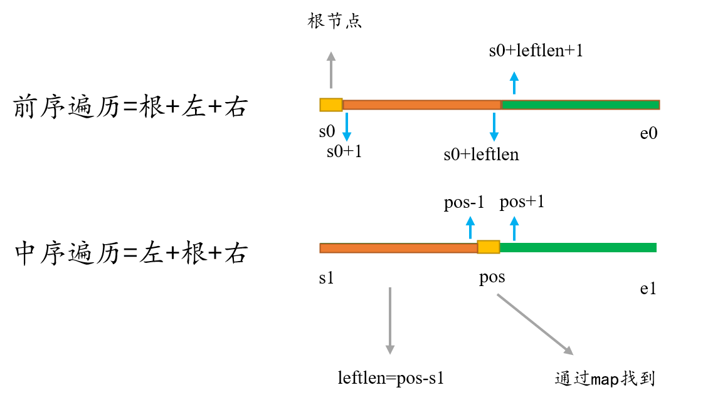

<font face="楷体" size = 3>
<center><font face="楷体" size=6, color='red'> 二叉树 </font> </center>

### 基础知识
**二叉树的遍历方式：**
 (1) DFS: 前序遍历、中序遍历、后序遍历
 (2) BFS: 层序遍历

这里前中后，其实指的就是**中间节点的遍历顺序**
前序遍历：中左右
中序遍历：左中右
后序遍历：左右中

由前序和中序遍历、由中序和后序遍历序列可以唯一确定一棵二叉树，而由前序和后序遍历序列不能唯一确定一棵二叉树。

**完全二叉树**
定义：在完全二叉树中，除了最底层节点可能没填满外，其余每层节点数都达到最大值，并且最下面一层的节点都集中在该层最左边的若干位置。

**二叉搜索树**
左子树上所有结点的值均小于它的根结点的值，右子树上所有结点的值均大于它的根结点的值。

**平衡二叉搜索树**
又被称为`AVL（Adelson-Velsky and Landis）`树，且具有以下性质：它是一棵空树或它的**左右两个子树的高度差的绝对值不超过1**，并且左右两个子树都是一棵平衡二叉树。

`C++`中`map、set、multimap，multiset`的底层实现都是平衡二叉搜索树，所以其增删操作的时间复杂度是`logn`。
而`unordered_map、unordered_set，unordered_multimap、unordered_multiset`底层实现是哈希表。

---

### 144. 二叉树的前序遍历

**递归**
```c++
class Solution {
public:
    vector<int>ans;
    void dfs(TreeNode* root){
        if (!root) return;
        ans.push_back(root->val);
        dfs(root->left);
        dfs(root->right);
    }
    vector<int> preorderTraversal(TreeNode* root) {
        dfs(root);
        return ans;
    }
};
```

**迭代**
```c++
class Solution {
public:
    vector<int> preorderTraversal(TreeNode* root) {
        if (!root) return {};
        vector<int>ans;
        stack<TreeNode*>stk;
        stk.push(root);
        while (stk.size()) {
            auto e = stk.top();
            stk.pop();
            ans.push_back(e->val);
            if (e->right) stk.push(e->right);
            if (e->left) stk.push(e->left);
        }
        return ans;
    }
};
```
**三种遍历通用的模板**
```c++
class Solution {
public:
    typedef pair<TreeNode*, int>pti;
    vector<int> preorderTraversal(TreeNode* root) {
        vector<int>ans;
        stack<pti>s;
        s.push({root, 0});
        while (s.size()) {
            auto [node, type] = s.top();
            s.pop();
            if (!node) continue;
            if (type == 0) {
                s.push({node->right, 0});
                s.push({node->left, 0});
                s.push({node, 1});
            }
            else ans.push_back(node->val);
        }        
        return ans;
    }   
};
```
---

### 94. 二叉树的中序遍历
**递归**
```c++
class Solution {
public:
    vector<int>ans;
    void dfs(TreeNode* root) {
        if(!root) return;
        dfs(root->left);
        ans.push_back(root->val);
        dfs(root->right);
    }
    vector<int> inorderTraversal(TreeNode* root) {
        dfs(root);
        return ans;
    }
};
```

**迭代**
```c++
class Solution {
public:
    typedef pair<TreeNode*, int>pti;
    vector<int> inorderTraversal(TreeNode* root) {
        vector<int>ans;
        stack<pti>s;
        s.push({root, 0});
        while (s.size()) {
            auto [node, type] = s.top();
            s.pop();
            if (!node) continue;
            if (type == 0) {
                s.push({node->right, 0});
                s.push({node, 1});
                s.push({node->left, 0});
            }
            else ans.push_back(node->val);
        }        
        return ans;
    }
};
```
---

### 145. 二叉树的后序遍历
**递归**
```c++
class Solution {
public:
    vector<int>ans;
    void dfs(TreeNode* root) {
        if(!root) return;
        dfs(root->left);
        dfs(root->right);
        ans.push_back(root->val);
    }
    vector<int> postorderTraversal(TreeNode* root) {
        dfs(root);
        return ans;
    }
};
```
**迭代**
```c++
class Solution {
public:
    typedef pair<TreeNode*, int> pti;
    vector<int> postorderTraversal(TreeNode* root) {
        vector<int>ans;
        stack<pti>s;
        s.push({root, 0});
        while(s.size()) {
            auto [node, type] = s.top();
            s.pop();
            if(!node) continue;
            if(type == 0) {
                s.push({node, 1});
                s.push({node->right, 0});
                s.push({node->left, 0});
            }
            else ans.push_back(node->val);
        }
        return ans;
    }
};
```
--- 

### 102. 二叉树的层序遍历
```c++
class Solution {
public:
    vector<vector<int>> levelOrder(TreeNode* root) {
        vector<vector<int>>ans;
        queue<TreeNode*>q;
        if(root) q.push(root);
        while(q.size()){
            int len = q.size(); // 用于控制每一层的数量
            vector<int>res;
            while(len--) {
                auto e = q.front();
                q.pop();
                res.push_back(e->val);
                if (e->left) q.push(e->left);
                if (e->right) q.push(e->right);
            }
            ans.push_back(res);
        }
        return ans;
    }
};
```

---

### 226. 翻转二叉树
**递归**
```c++
class Solution {
public:
    TreeNode* invertTree(TreeNode* root) {
        if(!root) return root;
        auto tree = new TreeNode(root->val);
        tree->left = invertTree(root->right);
        tree->right = invertTree(root->left);
        return tree;
    }
};
```
**BFS迭代**
```c++
class Solution {
public:
    TreeNode* invertTree(TreeNode* root) {
        queue<TreeNode*>q;
        if(root) q.push(root);
        while(q.size()) {
            auto e = q.front();
            q.pop();
            // swap
            auto tmp = e->left; // 因为Treenode是指针，所以会对原来的root进行修改
            e->left = e->right;
            e->right = tmp;
            
            if(e->left) q.push(e->left);
            if(e->right) q.push(e->right);
        }
        return root;
    }
};
```
---

### 101. 对称二叉树

**递归**
```c++
class Solution {
public:
    bool isSymmetric(TreeNode* root) {
        if (!root) return 1;
        return helper(root->left, root->right);
    }
    bool helper(TreeNode* p, TreeNode* q) {
        if (!p && !q) return 1;
        if (!p || !q) return 0;
        if (p->val != q->val) return 0;
        return helper(p->left, q->right) && helper(p->right, q->left);
    }
};
```

**BFS**
依次读取每一层，然后判断每一层是否是回文的
空树用特殊的数字
```c++
class Solution {
public:
    bool isSymmetric(TreeNode* root) {
        queue<TreeNode*>q;
        if (root) q.push(root);
        while(q.size()) {
            int len = q.size();
            vector<int>res;
            while(len--) {
                auto e = q.front();
                q.pop();
                if (e) res.push_back(e->val);
                else res.push_back(101); // 正常的数字在[-100,100]
                if (e) {
                    q.push(e->left);
                    q.push(e->right);
                }
            }
            // check res是不是对称的
            int l = 0, r = res.size() - 1;
            while(l < r) 
                if (res[l++] != res[r--]) return 0;
        }
        return 1;
    }
};
```

---

### 104. 二叉树的最大深度
**递归**
```c++
class Solution {
public:
    int maxDepth(TreeNode* root) {
        if(!root) return 0;
        return max(maxDepth(root->left), maxDepth(root->right)) + 1;
    }
};
```
**BFS**
```c++
class Solution {
public:
    int maxDepth(TreeNode* root) {
        queue<TreeNode*>q;
        int ans = 0;
        if (root) q.push(root);
        while(q.size()) {
            int len = q.size();
            ans++;
            while(len--) {
                auto e = q.front();
                q.pop();
                if(e->left) q.push(e->left);
                if(e->right) q.push(e->right);
            }
        }
        return ans;
    }
};
```
---

### 111. 二叉树的最小深度
**递归**
```c++
class Solution {
public:
    int minDepth(TreeNode* root) {
        if (!root) return 0;
        if (!root->left && !root->right) return 1;
        if (!root->left) return minDepth(root->right) + 1;
        if (!root->right) return minDepth(root->left) + 1;
        return min(minDepth(root->left), minDepth(root->right)) + 1;
    }
};
```
**BFS**
```c++
class Solution {
public:
    int minDepth(TreeNode* root) {
        queue<TreeNode*>q;
        int depth = 0;
        if (root) q.push(root);
        while(q.size()) {
            int len = q.size();
            depth++;
            while(len--) {
                auto e = q.front();
                q.pop();
                // 找到了第一个叶子节点
                if (!e->left && !e->right) return depth; 
                if (e->left) q.push(e->left);
                if (e->right) q.push(e->right);
            }
        }
        return depth;
    }
};
```

---

### 222. 完全二叉树的节点个数

**直接用BFS统计节点的个数**（不仅仅适用于完全二叉树）
```c++
class Solution {
public:
    int countNodes(TreeNode* root) {
        queue<TreeNode*>q;
        int num = 0;
        if(root) q.push(root);
        while(q.size()) {
            auto e = q.front();
            q.pop();
            num++;
            if(e->left) q.push(e->left);
            if(e->right) q.push(e->right); 
        }
        return num;
    }
};
```
**递归**(不仅仅适用于完全二叉树)
```c++
class Solution {
public:
    int countNodes(TreeNode* root) {
        if (!root) return 0;
        return countNodes(root->left) + countNodes(root->right) + 1;
    }
};
```
上述时间复杂度都是$O(n)$

**标准算法：二分+位运算**
根据二叉树的性质：只有最后一层的右边是不满的，剩下的都是满的
(1)先计算出数左边的深度为`n+1`, 则除了最后一层的节点个数为$2^{n} - 1$
(2)然后用二分计算最后一层有多少个节点。
(3)假设按层序遍历的顺序给数的节点编号，则最后一层的编号可能的范围为$[2^n, 2^{n+1} - 1]$,左边界表示最后一层只有一个节点，右边界表示满树
(4)假设树的前3层是满的，最后一层只有左边3个,如何判断第`k=10`个节点是否存在呢，首先得到10的二进制表示为`1010`
除了第一个1表示根节点，剩下的数字0表示左节点，1表示右节点。
```
            1
        2       3
    4     5   6     7
 8   9  10
```

**时间复杂度$o(log^2n)$**
分析：第一步计算树的深度为$O(logn)$
后面二分查找的复杂度为$O(logn)$, 每次判断需要从根节点走到最下面，所有复杂度为$O(logn)$

```c++
class Solution {
public:
    int countNodes(TreeNode* root) {
        if (!root) return 0;
        int depth = 0;
        TreeNode* node = root;
        while(node) {
            depth++;
            node = node->left;
        }
        // 计算出了树的深度，开始二分
        int l = 1 << (depth - 1), r = (1 << depth) - 1;
        while(l < r) {
            int mid = (l + r + 1) >> 1;
            if (existed(root, mid, depth)) l = mid;
            else r = mid - 1;
        } 
        return l;
    }
    bool existed(TreeNode* node, int x, int depth) { // 在树node中找编号为x的节点是否存在
        for (int k = depth - 2; k >= 0; k--){
            int d = (x >> k) & 1;
            if(!d) node = node->left;
            else node = node->right;
            if(!node) return 0;
        }
        return 1;
    }   
};
```
---

### 110. 平衡二叉树
定义：一个二叉树每个节点的左右两个子树的高度差的绝对值不超过 1

判断给定的树是不是平衡二叉树

**自顶向下** (会有重复的计算)
```c++
class Solution {
public:
    int Depth(TreeNode* root) {
        if(!root) return 0;
        return max(Depth(root->left), Depth(root->right)) + 1;
    }
    bool isBalanced(TreeNode* root) {
        if(!root) return 1;
        return (isBalanced(root->left) && isBalanced(root->right) && abs(Depth(root->left) - Depth(root->right)) < 2) ? 1 : 0;  
    }
};
```
**自低向下**
```c++
class Solution {
public:
    int Depth(TreeNode* root) {
        if(!root) return 0;
        // 后序遍历
        int l_depth = Depth(root->left);
        int r_depth = Depth(root->right);
        // -1表示当前子树已经不是平衡的了
        if (l_depth == -1 || r_depth == -1 || abs(l_depth - r_depth) > 1) return -1;
        // 正常情况返回树的高度
        return max(l_depth, r_depth) + 1;
    } 
    bool isBalanced(TreeNode* root) {
        return Depth(root) == -1 ? 0 : 1;
    }
};
```

---

### 257. 二叉树的所有路径
```c++
class Solution {
public:
    vector<string>ans;
    void DFS(TreeNode* root, string s) {
        s += to_string(root->val);
        // 找到了叶子节点
        if (!root->left && !root->right) ans.push_back(s);
        s += "->";
        if (root->left) DFS(root->left, s);
        if (root->right) DFS(root->right, s);
    }
    vector<string> binaryTreePaths(TreeNode* root) {
        string s;
        DFS(root, s);
        return ans;
    }
};
```
---

### 404. 左叶子之和
注意是：左边的叶子节点，中间的左节点不算
**DFS**
```c++
class Solution {
public:
    int sumOfLeftLeaves(TreeNode* root) {
        if (!root) return 0;
        int l = sumOfLeftLeaves(root->left); // 左子树的左叶子之和
        int r = sumOfLeftLeaves(root->right); // 右子树的左叶子之和
        int num = (root->left && !root->left->left && !root->left->right) ? root->left->val : 0;
        return l + r + num;
    }
};
```
**BFS**
```c++
class Solution {
public:
    typedef pair<TreeNode*, int>pti;
    int sumOfLeftLeaves(TreeNode* root) {
        queue<pti>q;
        int ans = 0;
        if (root) q.push({root, -1});
        while (q.size()) {
            auto [e, f] = q.front();
            q.pop();
            if (!e->left && !e->right && f == 0) ans += e->val;
            if (e->left) q.push({e->left, 0});
            if (e->right) q.push({e->right, 1});
        }
        return ans;
    }
};
```

---

### 513. 找树左下角的值
找出二叉树的 **最底层 最左边** 节点的值。
注意不仅仅是找到最左边的值
**BFS**
```c++
class Solution {
public:
    int findBottomLeftValue(TreeNode* root) {
        queue<TreeNode*>q;
        if (root) q.push(root);
        vector<int>res;
        while(q.size()) {
            int len = q.size();
            res.clear();
            while(len--) {
                auto e = q.front();
                q.pop();
                res.push_back(e->val);
                if (e->left) q.push(e->left);
                if (e->right) q.push(e->right);
            }       
        }
        return res[0];
    }
};
```

**DFS**
```c++
class Solution {
public:
    int curh = -1, ans = 0;
    void DFS(TreeNode* root, int h) {
        if (!root) return ;
        DFS(root->left, h + 1);
        DFS(root->right, h + 1);
        if (h > curh) { // 高度变大的一开始才会更新ans，同时是前序遍历，因此符合题目要求找的结果
            curh = h;
            ans = root->val;
        }
    }
    int findBottomLeftValue(TreeNode* root) {
        DFS(root, 0);
        return ans;
    }
};
```

---

### 112. 路径总和
判断树中是否存在 **根节点到叶子节点** 的路径，这条路径上所有节点值相加等于目标和 `targetSum`

```c++
class Solution {
public:
    bool hasPathSum(TreeNode* root, int targetSum) {
        if (!root) return 0;
        if (!root->left && !root->right) return (root->val == targetSum);
        int left = targetSum - root->val;
        return hasPathSum(root->left, left) || hasPathSum(root->right, left);
    }
};
```
---

###  105. 从前序与中序遍历序列构造二叉树
`reorder = [3,9,20,15,7], inorder = [9,3,15,20,7]`
前序：根左右
中序：左根右


```c++
class Solution {
public:
    unordered_map<int, int> hx;
    TreeNode* buildTree(vector<int>& preorder, vector<int>& inorder) {
        int n = preorder.size();
        for (int i = 0; i < n; i++) hx[inorder[i]] = i;
        return build(preorder, inorder, 0, n - 1, 0, n - 1);
    }
    TreeNode* build(vector<int>& pre, vector<int>& in, int s0, int e0, int s1, int e1) {
        if (s0 > e0) return nullptr;
        int root = pre[s0];
        int pos = hx[root];
        int leftlen = pos - s1;

        auto node = new TreeNode(root);
        node->left = build(pre, in, s0 + 1, s0 + leftlen, s1, pos - 1);
        node->right = build(pre, in, s0 + leftlen + 1, e0, pos + 1, e1);
        return node;

    }
};
```

---

### 106. 从中序与后序遍历序列构造二叉树
和上题思路一样。
```c++
class Solution {
public:
    unordered_map<int, int>hx;
    TreeNode* buildTree(vector<int>& inorder, vector<int>& postorder) {
        int n = inorder.size();
        for (int i = 0; i < n; i++) hx[inorder[i]] = i;
        return build(inorder, postorder, 0, n - 1, 0, n - 1);
    }
    TreeNode* build(vector<int>& in, vector<int>& post, int s0, int e0, int s1, int e1) {
        if (s0 > e0) return nullptr;
        int root = post[e1];
        int pos = hx[root];
        int leftlen = pos - s0;
        auto node = new TreeNode(root);
        node->left = build(in, post, s0, pos - 1, s1, s1 + leftlen - 1);
        node->right = build(in, post, pos + 1, e0, s1 + leftlen, e1 - 1);
        return node;
    }
};
```
---

### 654. 最大二叉树
创建一个根节点，其值为数组 `nums` 中的最大值。
递归地在最大值 左边 的 子数组前缀上 构建左子树。
递归地在最大值 右边 的 子数组后缀上 构建右子树。

思路：
在数组中先找到最大值所在的位置，然后分成左右区间分别构建左右子树
```c++
class Solution {
public:
    TreeNode* constructMaximumBinaryTree(vector<int>& nums) {
        return build(nums, 0, nums.size() - 1);
    }
    TreeNode* build(vector<int> & nums, int s, int e) {
        if (s > e) return nullptr;
        int pos = s;
        for (int i = s; i <= e; i++) 
            if (nums[i] >= nums[pos]) pos = i;
        auto node = new TreeNode(nums[pos]);
        node->left = build(nums, s, pos - 1);
        node->right = build(nums, pos + 1, e);
        return node;
    }
};
```
---

### 617. 合并二叉树
两个树取并集
```c++
class Solution {
public:
    TreeNode* mergeTrees(TreeNode* root1, TreeNode* root2) {
        if(!root1 && !root2) return nullptr;
        auto node = new TreeNode;
        if(!root1) node = root2;
        else if(!root2) node = root1;
        else {
            node->val = root1->val + root2->val;
            node->left = mergeTrees(root1->left, root2->left);
            node->right = mergeTrees(root1->right, root2->right);
        }
        return node;
    }
};
```
---

### 98. 验证二叉搜索树（BST）
有效二叉搜索树定义如下：
节点的左子树只包含**小于**当前节点的数。
节点的右子树只包含**大于**当前节点的数。
所有左子树和右子树自身必须也是二叉搜索树。
有时规定的BST有等于

自上而下判断每个节点的值是否在规定的范围内
```c++
class Solution {
public:
    bool isValidBST(TreeNode* root) {
        return DFS(root, LONG_MIN, LONG_MAX);
    }
    bool DFS(TreeNode* root, long long vmin, long long vmax) {
        if (!root) return 1;
        if (root->val <= vmin || root->val >= vmax) return 0;
        return DFS(root->left, vmin, root->val) && DFS(root->right, root->val, vmax);
    }
};
```
---

### 530. 二叉搜索树的最小绝对差
关键性质：二叉搜索树的**中序遍历**为排好序的递增的序列

```c++
class Solution {
public:
    int ans = 1e8, pre = -1; //pre记录上一个节点的值
    int getMinimumDifference(TreeNode* root) {
        dfs(root);
        return ans;
    }
    void dfs (TreeNode* node) {
        if(!node) return;
        dfs(node->left);
        // 处理逻辑
        if (pre == -1) { // 当前是第一个节点
            pre = node->val;
        }
        else {
            ans = min(ans, node->val - pre);
            pre = node->val;
        }
        dfs(node->right);

    }
};
```
---

### 236. 二叉树的最近公共祖先
若`root`是 `p,q` 的 **最近公共祖先** ，则只可能为以下情况之一：

1. `p` 和 `q` 在 `root `的子树中，且分列 `root` 的异侧
2. `p=root`, 且 `q` 在 `root` 的左或右子树中；
3. `q=root`，且 `p` 在 `root` 的左或右子树中；


```c++
class Solution {
public:
    TreeNode* lowestCommonAncestor(TreeNode* root, TreeNode* p, TreeNode* q) {
        if (!root) return nullptr;
        if (root == p || root == q) return root;
        auto l = lowestCommonAncestor(root->left, p, q);
        auto r = lowestCommonAncestor(root->right, p, q);
        if (l && r) return root;
        else if (l) return l;
        else if (r) return r;
        else return nullptr;
    }
};
```
---

### 235. 二叉搜索树的最近公共祖先
```c++
class Solution {
public:
    TreeNode* lowestCommonAncestor(TreeNode* root, TreeNode* p, TreeNode* q) {
        if (root->val > p->val && root->val > q->val) return lowestCommonAncestor(root->left, p, q);
        if (root->val < p->val && root->val < q->val) return lowestCommonAncestor(root->right, p, q);
        return root; 
    }
};
```
---


### 701. 二叉搜索树中的插入操作
将某个值插入二叉搜索树。
```c++
class Solution {
public:
    TreeNode* insertIntoBST(TreeNode* root, int val) {
        if (!root) return new TreeNode(val);
        if (val > root->val) {
            if (root->right) insertIntoBST(root->right, val);
            else {
                auto newtree = new TreeNode(val);
                root->right = newtree;
            }
        }
        else {
            if (root->left) insertIntoBST(root->left, val);
            else {
                auto newtree = new TreeNode(val);
                root->left = newtree;
            }
        }
        return root;
    }
};
``` 
---


### 450. 删除二叉搜索树中的节点
删除的节点key不一定存在，如果存在唯一
```c++
class Solution {
public:
    TreeNode* deleteNode(TreeNode* root, int key) {
        if(!root) return root;
        if (root->val == key) {
            auto l = root->left;
            auto r = root->right;
            if (l && r) {
                auto ll = r;
                while(ll->left) ll = ll->left;
                ll->left = l;
                return r;
            }
            else return !r ? l : r;
        }
        else if (root->val > key) {
            root->left = deleteNode(root->left, key);
            return root;
        }
        else {
            root->right = deleteNode(root->right, key);
            return root;
        }
    }
};
```
---


### 669. 修剪二叉搜索树
修剪`BST`使得节点的范围在`[low, high]`之间
```c++
class Solution {
public:
    TreeNode* trimBST(TreeNode* root, int low, int high) {
        if(!root) return root;
        root->left = trimBST(root->left, low, high);
        root->right = trimBST(root->right, low, high);
        if (root->val < low) return root->right;
        else if(root->val > high) return root->left;
        else  return root;
    }
};
```
---


### 108. 将有序数组转换为二叉搜索树
将其转换为一棵 **高度平衡**的二叉搜索树。即每个节点的左右两个子树的高度差的绝对值不超过 1 

```c++
class Solution {
public:
    TreeNode* sortedArrayToBST(vector<int>& nums) {
        return build(nums, 0, nums.size() - 1);
    }
    TreeNode* build(vector<int>& nums, int l, int r) {
        if (l > r) return nullptr;
        int mid = (l + r) / 2;
        auto node  = new TreeNode(nums[mid]);
        node->left = build(nums, l, mid - 1);
        node->right = build(nums, mid + 1, r);
        return node;
    }
};
```
---

### 129. 求根节点到叶节点数字之和
```
 1
2 3

ans = 12 + 13 = 25
```

```c++
class Solution {
public:
    int dfs(TreeNode* node, int sum) {
        sum = sum * 10 + node->val;
        if(!node->left && !node->right) return sum;
        if(!node->left) return dfs(node->right, sum);
        if(!node->right) return dfs(node->left, sum);
        return dfs(node->left, sum) + dfs(node->right, sum);
    } 
    int sumNumbers(TreeNode* root) {
        return dfs(root, 0);
    }
};
```
---

### 1382. 将二叉搜索树变平衡
将一个二叉搜索树变为平衡的二叉搜索树

#### 思路：中序遍历得到递增序列 + (108. 将有序数组转换为平衡的二叉搜索树)
```c++
class Solution {
public:
    vector<int>nums;
    // 中序遍历，放入nums
    void dfs(TreeNode* node){
        if (!node) return ;
        dfs(node->left);
        nums.push_back(node->val);
        dfs(node->right);
    }
    TreeNode* build(int l, int r) {
        if(l > r) return nullptr;
        int mid = (l + r) >> 1;
        auto node = new TreeNode(nums[mid]);
        node->left = build(l, mid - 1);
        node->right = build(mid + 1, r);
        return node;
    }
    TreeNode* balanceBST(TreeNode* root) {
        dfs(root);
        return build(0, nums.size() - 1);
    }
};
```
---