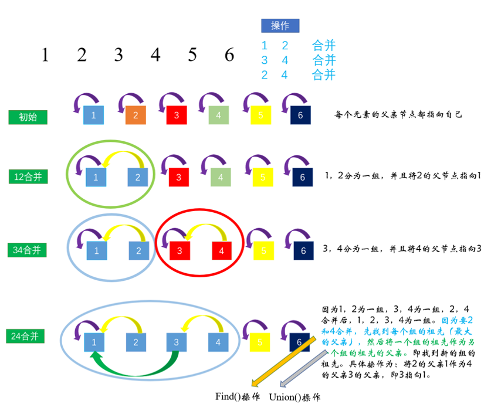
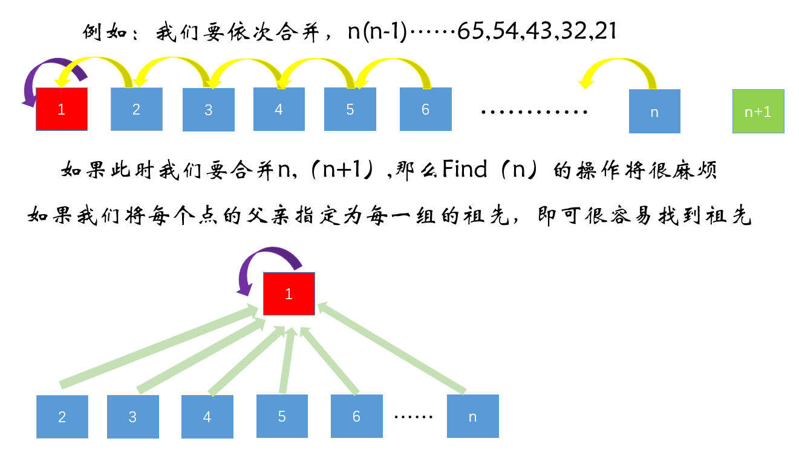

<font face="楷体" size = 3>

<center><font face="楷体" size=6, color='red'> 并查集 </font> </center>

### 基本思想


#### 路径压缩 


### 模板
```c++
// 初始化：
for(int i = 1; i <= n; i++) f[i] = i; // 初始化每个节点的父节点为本身

// Find(x)操作
int find(int x) {
    if(f[x] != x) f[x] = find(f[x]);
    return f[x];
}

// Union操作 [不必写成一个函数，直接判断]
int fa = Find(a);
int fb = Find(b);
if(fa != fb) f[fa] = fb;

// 如果要额外计算连通块中点的数量， 加个cnt数组

// 初始化
for(int i = 1; i <= n; i++) f[i] = i, cnt[i] = 1; 

// 合并
int fa = Find(a), fb = Find(b);
if (fa != fb) {
    f[fa] = fb;
    cnt[fb] += cnt[fa];
}

// 输出x所在的连通块中点的数量
int fx = Find(x);
cout << cnt[fx] << endl;
```
---